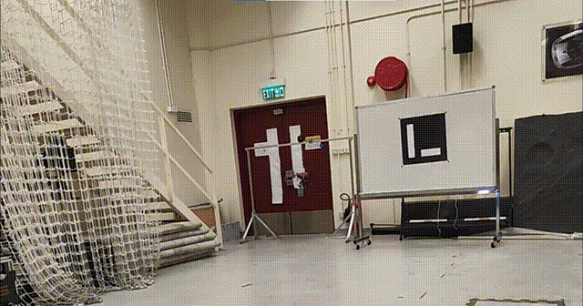

# LiDAR Marker: An Intensity-Based Region Growing Fiducial Marker System for LiDAR
<!--  -->

<div align="center">
  
</div>

## Overview
This repository is for the intensity-based region growing fiducial LiDAR Marker system.


## Dependencies
- **Libraries**:
  - PCL (Point Cloud Library) 1.8+
  - Eigen3
  - Boost Thread
  - OpenCV


## Compilation
```bash
cd catkin_ws/src
# Then clone this repository.

cd ..
catkin_make

# Run the code
source ./devel/setup.bash
rosrun lidar_marker process_pcd
```
