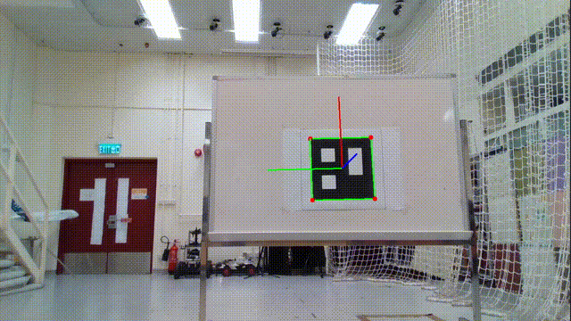
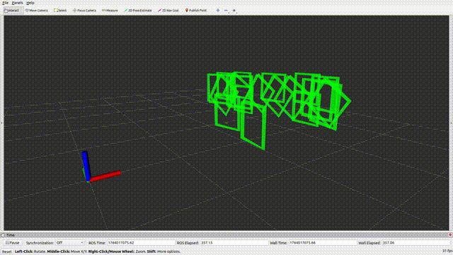

# LiDAR Marker: An Intensity-Based Region Growing Fiducial Marker System for LiDAR
<!--  -->

<div align="center">
  
</div>

# Overview
LiDAR Marker is a fiducial marker system for LiDAR.

This system includes a printed paper marker and a marker detection pipeline. It is built on two properties of LiDAR sensors: **LiDAR can operate at night**, and it **returns different intensity responses to different colors**. Based on these, we design a fiducial marker that can be detected by LiDAR. This makes marker-based localization possible in scenes where cameras cannot function well.


This system is developed by learning from both the strengths and limitations of related work. It has the following features:

1. The marker **does not need to be placed separately**. Users can deploy it based on their application needs.
2. The system uses an intensity-based region growing method, which **enables detection in complex backgrounds**.
3. The system uses a geometry-constrained OBB fitting method to **estimate the optimized marker pose**.
4. The system develops a spherical angular-radial neighbor search method. Compared with common point cloud nearest neighbor search methods, such as KD-Tree and Octree, this method achieves **faster k-nearest neighbor search time without relying on GPU or other third-party libraries**.

<p align="center">
  
</p>
<p align="center">
  <em>Figure 1. Visualization of the intensity-based region growing method.</em>
</p>

<p align="center">
  
</p>
<p align="center">
  <em>Figure 2. Visualization of the intensity-based region growing method.</em>
</p>


<p align="center">
  
  
</p>
<p align="center">
  <em>Figure 3. (Application) Automated Camera-LiDAR Calibration.</em>
</p>


## Dependencies
- **Libraries**:
  - PCL (Point Cloud Library) 1.8+
  - Eigen3
  - Boost Thread
  - OpenCV


## Compilation
```bash
cd catkin_ws/src
# Then clone this repository.

cd ..
catkin_make

# Run the code
source ./devel/setup.bash
rosrun lidar_marker process_pcd
```
